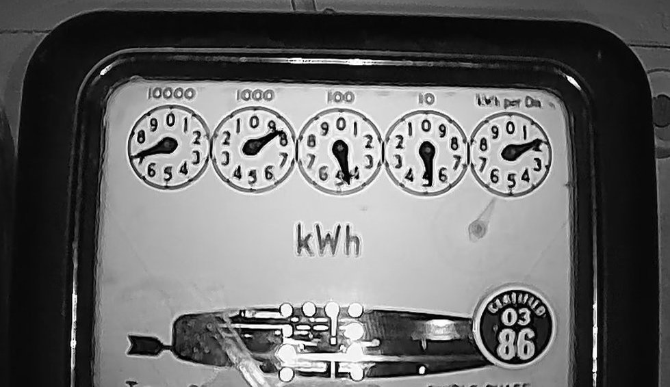
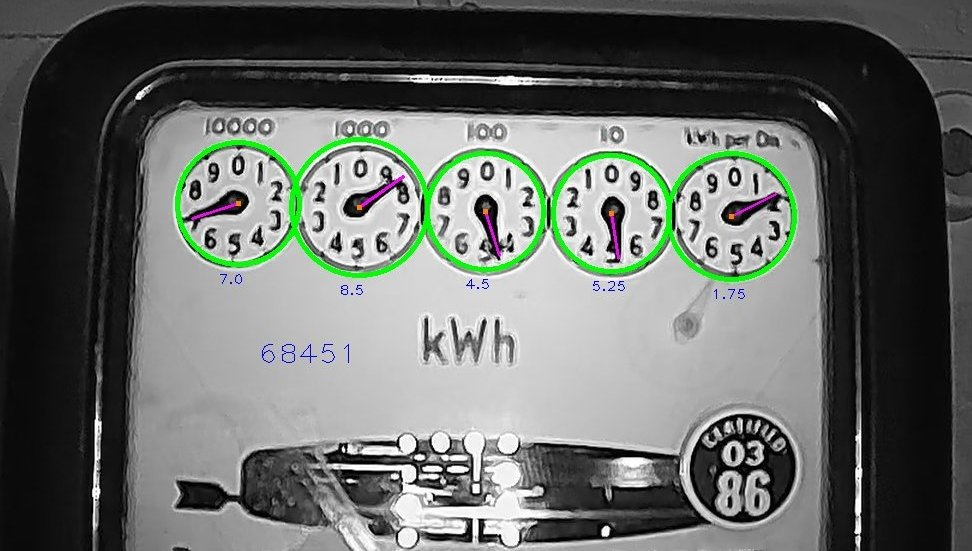

# dial-meter-reader-opencv-py

Analog Mater Reader using OpenCV/Python

## How it's done

* Read image from a configured video stream (e.g. local webcam)
* Find circles using [Hough Circles](https://docs.opencv.org/4.5.2/da/d53/tutorial_py_houghcircles.html) (currently with pre-defined radius range)
* Find circles which are roughly on the same level
* If a predefined number of circles is found, continue... otherwise start over
* For each circle, find the needle orientation (angle and corresponding value 0-9)
  * Divide the circle into N sections (currently hard-coded to 40, so we get 40 angles)
  * For each angle, start from the centre of the circle and count number of continuous dark pixels
  * The angle with the highest number of continuous dark pixels is (probably) where is the (presumably dark) needle
  * Determine the orientation of the dial (CW - clockwise or CCW - counter clockwise... currently hard-coded) to get the actual reading
* "Fix" the readings... i.e. if the first value is 7.0 and the next value is 5.75, the first value should actually be 6.x.
  This is to fix the incorrect reading caused by the position of the camera (e.g. pointing upwards, so 6.9 looks like 7.0).

## How to run it

### Pre-Requisites

* Python 3
* Install Python virtual environment
* Install Python dependencies with `pip install`.

### Configuration

Copy the `config-sample.ini` to `config.ini`, update it accordingly.

### Running

Run `python run.py`.

## Test setup

* Computer with Python3
* Web cam connected to a home router.
  I've used a [cheap POE camera from Aliexpress](https://www.aliexpress.com/item/32885834218.html), so that I could connect it via cable and also access it via HTTP/RTSP protocol. The camera however tried to ping/send requests to some dodgy domain, so I've blocked that on my router and only allowed secure local access.
  (I don't want random people to see my meter readings ;-))
* Raspberry Pi Zero W (WIP - I'm trying to get the code run on it)

## Links

* <https://opencv-python-tutroals.readthedocs.io/en/latest/py_tutorials/py_feature2d/py_feature_homography/py_feature_homography.html>
* <https://stackoverflow.com/questions/20891936/rtsp-stream-and-opencv-python>
